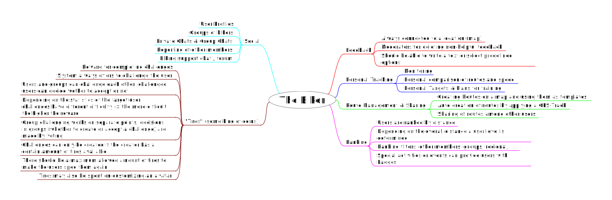

# Drafts for the Biker application

This directory contains rough ideas and sketches for some UI design, model & DB layout etc. Though I will try to keep it up to date, I cannot promise that everything is 100% accurate at all times.

If *anybody* feels like there is something missing or wants to discuss or improve a feature please file an issue or see the main README file for other ways of communicating to me & the (hopefully soon evolving) community.

## Basic ideas for the application

Some ideas for users and using the application are drawn in this mind map. If ideas become more specific and implementation outline forms out, there will be a separate description for the features, for the major ones possibly some wiki articles and feature issues.

This is by far not an exhaustive list of features that will be available in the end, and in this mind map there are no technical requirements at all. If requirements are formulated, they will be available somewhere here in the repository as well.

The mind map was created with [FreePlane](https://www.freeplane.org/), the map file is in this directory as well.

## Model

This is kind of a domain model of the application. This will roughly be the model defined in django and thus correspond to the database tables. Note that some of the elements will have to be integrated with other django apps, e.g. the core user functionality is provided by standard `django auth` in conjunction with `django-allauth`, but still the user has to be extended by custom fields.

This diagram was created with [Umlet](https://www.umlet.com/), a simple UML tool. The Umlet File for this diagram is contained in here as well.

## UI

Currently, the application uses bootstrap CSS framework with the default theme, there has been no effort in customizing it so far. There is project in progress on pulling all existent views into this styling.

There are still many issues with the design itself and having a CSS framework at hand does not mean you don't have to create a decent layout by deciding of visible elements and their positioning :)

If someone feels like sketching some views they are highly appreciated! See the contributing section in the main README file.
